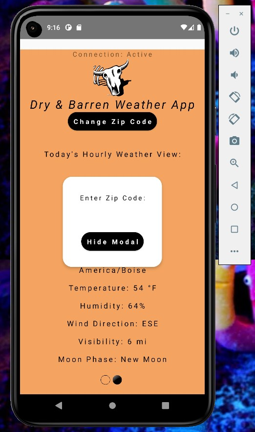

# weatherAppProject
Mobile app using React Native and JavaScript that displays weather conditions based on zip codes entered by users from a modal. Data is fetched from a weather API, and network connection status is displayed as active or inactive. Two views of current and hourly weather are viewable with left and right swipe actions.

  

